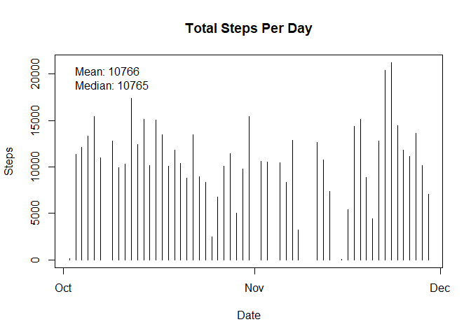
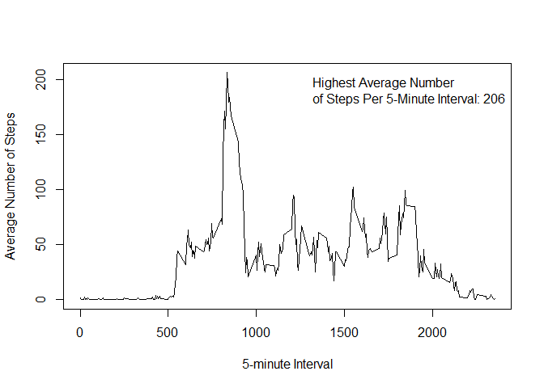
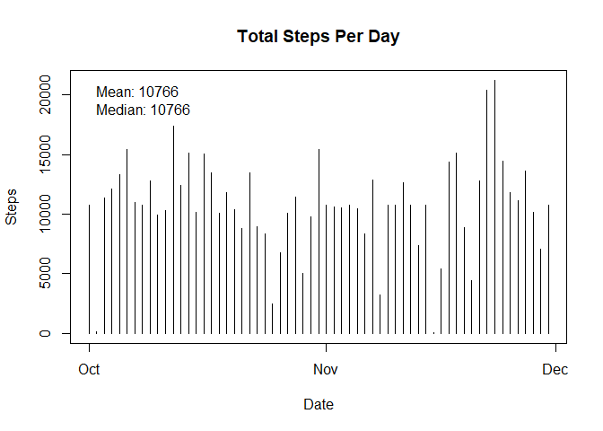
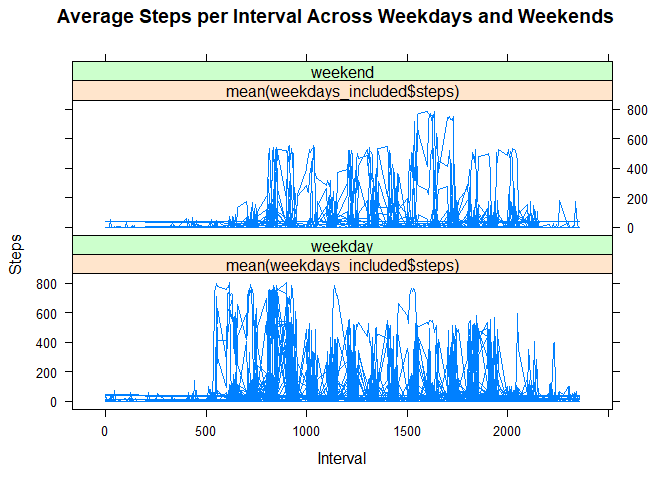

Set file path to save download to

```r
path <- file.path(paste(getwd(), 'repdata%2Fdata%2Factivity.zip', sep = "/"))
```


Set url for download

```r
url <- "https://d396qusza40orc.cloudfront.net/repdata%2Fdata%2Factivity.zip"
```


Download file and save to working directory

```r
download.file(url, path)
```


Unzip file and put it in user's current working directory

```r
chooseFile<-file.choose()
workingDir<-getwd()
unzip(chooseFile,exdir = workingDir)
```

```
## Warning in unzip(chooseFile, exdir = workingDir): error 1 in extracting
## from zip file
```


Read files

```r
activity_data <- read.csv("activity.csv")
```


Convert date variable to Date data type
Date in year-month-day format

```r
activity_data$date <- as.POSIXct(activity_data$date)
```


Check environment for dplyr package and install or not as required
credit Matthew on StackOverflow https://stackoverflow.com/users/4125693/matthew

```r
using<-function(...) {
    libs<-unlist(list(...))
    req<-unlist(lapply(libs,require,character.only=TRUE))
    need<-libs[req==FALSE]
    n<-length(need)
    if(n>0){
        libsmsg<-if(n>2) paste(paste(need[1:(n-1)],collapse=", "),",",sep="") else need[1]
        print(libsmsg)
        if(n>1){
            libsmsg<-paste(libsmsg," and ", need[n],sep="")
        }
        libsmsg<-paste("The following packages could not be found: ",libsmsg,"\n\r\n\rInstall missing packages?",collapse="")
        if(winDialog(type = c("yesno"), libsmsg)=="YES"){
            install.packages(need)
            lapply(need,require,character.only=TRUE)
        }
    }
}
```


Install and load packages

```r
using("dplyr")
```

```
## Loading required package: dplyr
```

```
## Warning: package 'dplyr' was built under R version 3.4.3
```

```
## 
## Attaching package: 'dplyr'
```

```
## The following objects are masked from 'package:stats':
## 
##     filter, lag
```

```
## The following objects are masked from 'package:base':
## 
##     intersect, setdiff, setequal, union
```

```r
using("lattice")
```

```
## Loading required package: lattice
```

```
## Warning: package 'lattice' was built under R version 3.4.3
```


Total number of steps taken per day IGNORE NAS

```r
total_steps_day <- na.omit(activity_data) %>% group_by(date) %>% summarise(total = sum(steps))
```


Make a histogram of the total number of steps taken each day then calculate and report the mean and median of the total number of steps taken per day

```r
plot(total_steps_day$date, total_steps_day$total, type = "h", xlab = "Date", ylab = "Steps", main = "Total Steps Per Day")
legend("topleft", bty="n", c(paste("Mean:", round(mean(total_steps_day$total)), paste("\nMedian:"), median(total_steps_day$total))))
```

<!-- -->


Make a time series plot (i.e. type = "l") of the 5-minute interval (x-axis) and the average number of steps taken, averaged across all days (y-axis). Which 5-minute interval, on average across all the days in the dataset, contains the maximum number of steps?

```r
average_steps_intervals <- na.omit(activity_data) %>% group_by(interval) %>% summarise(average = mean(steps))
plot(average_steps_intervals$interval, average_steps_intervals$average, type="l", xlab = "5-minute Interval", ylab = "Average Number of Steps")
legend("topright", bty="n", c(paste("Highest Average Number\nof Steps Per 5-Minute Interval:", round(max(average_steps_intervals$average)))))
```

<!-- -->


Calculate and report the total number of missing values in the dataset (i.e. the total number of rows with  NAs)

```r
sum(!complete.cases(activity_data))
```

```
## [1] 2304
```


Create a new dataset that is equal to the original dataset but with the missing data filled in

```r
activity_data_missing_cleaned <- activity_data
activity_data_missing_cleaned$steps[is.na(activity_data_missing_cleaned$steps)] <- mean(activity_data_missing_cleaned$steps, na.rm=TRUE)
```


Total number of steps taken per day NAs replaced with mean

```r
total_steps_day_complete <- activity_data_missing_cleaned %>% group_by(date) %>% summarise(total = sum(steps))
```


Make a histogram of the total number of steps taken each day. Calculate and report the mean and median of the total number of steps taken per day.

```r
plot(total_steps_day_complete$date, total_steps_day_complete$total, type = "h", xlab = "Date", ylab = "Steps", main = "Total Steps Per Day")
legend("topleft", bty="n", c(paste("Mean:", round(mean(total_steps_day_complete$total)), paste("\nMedian:"), round(median(total_steps_day_complete$total)))))
```

<!-- -->


## The mean and median for the NAs removed and NAs replaced differs slightly. The impact is that the sample does not represent the population as closely when NAs are removed.


Create a new factor variable in the dataset with two levels "weekday" and "weekend" indicating whether a given date is a weekday or weekend day

```r
weekdays_included <- mutate(activity_data_missing_cleaned, Weekdays = weekdays(activity_data_missing_cleaned$date))
```


Change names of Saturday and Sunday to "weekend"

```r
weekdays_included[weekdays_included$Weekdays %in% c("Saturday", "Sunday"),4] <- "weekend"
```


Change names of Monday to Friday to "weekday"

```r
weekdays_included[!(weekdays_included$Weekdays %in% c("weekend")),4] <- "weekday"
```


Change into factor with 2 levels

```r
weekdays_included$Weekdays <- as.factor(weekdays_included$Weekdays)
```


Plot it

```r
xyplot(weekdays_included$steps ~ weekdays_included$interval | mean(weekdays_included$steps) * weekdays_included$Weekdays, data = weekdays_included, type = "l", main="Average Steps per Interval Across Weekdays and Weekends", xlab="Interval", ylab= "Steps")
```

<!-- -->


